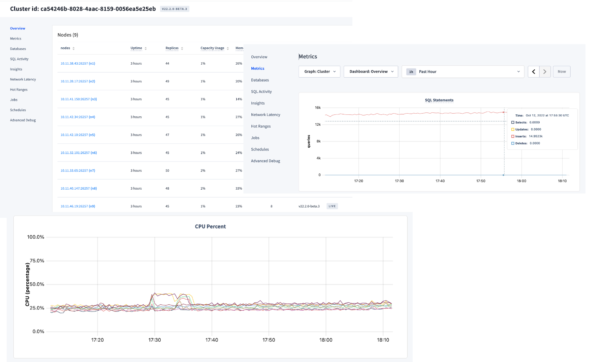

# roachinfo

The roachinfo effort is designed to gather quarterly usage, sizing and performance metrics from self-hosted clusters. This will help us to better understand the customer's journey and help them to be successful.

It is not always possible to get customers to run extensive data collection on all clusters.  The CEA often doesn’t have access to all layers of the organization or it is too tedious to run infrastructure and SQL level collection across all clusters in an organization.  To make this journey as easy as possible for the customer, the roachinfo program has been broken into two levels:  roachinfo light and roachinfo deep-dive.

## roachinfo light

This access level runs a simple SQL script and uses access to the DB console to gather usage and consumption data for their clusters.  The idea is to gather as much data that is possible via the [roachinfo-light.sh](roachinfo-light.sh) script  then have the CEA walk through some screen shots regarding usage.  This data is then used to record usage and consumption data for internal use at Cockroach.

### observations from dbconsole

The three values of memory%, CPU%, and QPS are meant to be gathered from the DB console with the customer and CEA.  This ensures the customer works with the CEA to gather usage information from their clusters.



### running the roachinfo-light.sh script

```bash
ubuntu@ip-10-11-35-10:~$ ./roachinfo-light.sh
Gathinging Cluster Information on Wed Oct 12 18:07:07 UTC 2022....
 
Please enter some observations from the DB console…
 
CPU% peak observation : 25
Memory% peak observation : 33
QPS peak observation : 15000
 
Summary of Cluster Statistics via SQL...
 
              Sample Date : 20221012
                ClusterID : ca54246b-8028-4aac-8159-0056ea5e25eb
             Organization : Cockroach Labs - Production Testing
                  Version : v22.2.0-beta.3
                    Build : CockroachDB CCL v22.2.0-beta.3 (x86_64-pc-linux-gnu, built 2022/10/10 18:21:25, go1.19.1)
              Total Nodes : 9
               vCPU total : 72
          Total Disk (GB) : 57
        Largest Table(GB) : 17
              Changefeeds : 0
    CPU% peak observation : 25
 Memory% peak observation : 33
     QPS peak observation : 15000
 
... Send Sample File to Cockroach Enterprise Architect : 20221012_ca54246b-8028-4aac-8159-0056ea5e25eb.tsv
```

The tsv file created is finally uploaded to the usage-selfhosted Cockroach Cloud cluster into the cluster_usage table.  The goal is to make this an automated process, but for the initial phase, the tsv files are simply added to the #usage_selfhosted slack channel for each cluster.

```sql
 CREATE TABLE cluster_usage (
   sample_date TIMESTAMPTZ NOT NULL,
   cluster_id UUID NOT NULL,
   organization TEXT,
   version TEXT,
   build TEXT,
   node_count INT,
   vcpu_count INT,
   disk_gb INT,
   largest_table_gb INT,
   changefeeds INT,
   cpu_pct INT,
   mem_pct INT,
   qps INT,
   PRIMARY KEY (sample_date, cluster_id)
 );
```

The usage data will be accessible via CC for analysis by internal teams at Cockroach Labs.

## roachinfo -- deep dive

In addition to information gathered with the [roachinfo-light.sh](roachinfo-light.sh) script, this process can be expanded to dive further into the usage patterns and cluster health.  To do this, roachinfo-light.sh is run, but in addition to this a “tsdump” and “debug zip” are also gathered and submitted via a support ticket.  This will ensure that the customer is trained on these procedures and allow us to further analyze usage patterns and cluster health.

### debug zip

To gather debug zip, the customer should follow the standard procedures described in their own runbooks.  The debug zip does not have to include all the log files for the last 24 hours.  See the example below and reference the debug zip [documentation](https://www.cockroachlabs.com/docs/v22.1/cockroach-debug-zip) for more details.

```bash
 date '+%Y-%m-%d %H:%M'
 2022-10-12 17:12

 cockroach debug zip ./debug.zip  --redact-logs --files-from='2022-10-11 17:12'
```

Once the debug zip is gathered, the customer will open a **support** ticket and attach the debug zip file.  The TSE team will review the debug zip for anomalies with their standard tooling and report back to the customer and CEA.

### tsdump

The tsdump function extracts the time series data and stores a compressed gzip file.  

```bash
 cockroach debug tsdump --host localhost --format csv --insecure \
 --from '2022-10-12 00:00' --to '2022-10-13 00:00' |gzip > tsdump.csv.gz
```

Once this data is collected, the customer will also upload this data to the support ticket created for the debug zip.  The CEA can analyze the data and upload to [oggy](https://oggy.crdb.dev/) displays series data gathered from customers.  

## review findings with customer

Once the Debug Zip and tsdump have been analyzed, the CEA can schedule a follow up session to discuss the findings.